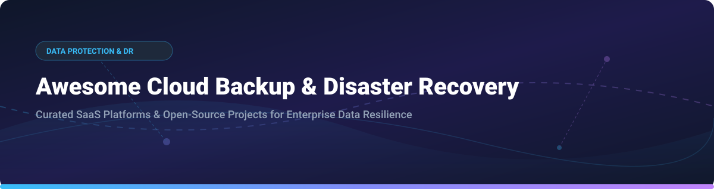

# Awesome Cloud Backup & Disaster Recovery 🚀

  

  
  
  
  
  

## 📌 Ecosystem Overview & Market Insights 💡

> **Market Analysis**: The global Cloud Backup & Disaster Recovery (DRaaS) market is estimated at **$14.2 Billion (2026)** and projected to reach over **$30 Billion by 2030** (CAGR ~18.5%).
> 
> **Market Structure**: The market is **moderately fragmented**. High-end enterprise data protection is led by established SaaS titans (Veeam, Rubrik, Cohesity), while open-source backup engines (Restic, Borg, Kopia, Velero) dominate developer, home lab, and self-hosted Kubernetes workloads.

Welcome to the ultimate curated directory of **Cloud Backup**, **Disaster Recovery (DR)**, **Ransomware Resilience**, and **Kubernetes Data Protection** solutions! 🛡️

---

## 📋 Table of Contents 📑

- [🏢 SaaS & Commercial Platforms](#-saas--commercial-platforms)
- [🔓 Open-Source GitHub Projects](#-open-source-github-projects)
- [🤝 How to Contribute](#-how-to-contribute)
- [💖 Support & Sponsorship](#-support--sponsorship)
- [📈 Star History](#-star-history)
- [⚠️ Disclaimer](#%EF%B8%8F-disclaimer)

---

## 🏢 SaaS & Commercial Platforms 💼

*Commercial cloud backup & disaster recovery platforms sorted by company scale (Valuation / Revenue).* 📊

| Product | Enterprise Scale (Valuation / Revenue) 📈 | Starting Pricing Tier 💵 | Free Tier / Trial Limits ⏳ | Description 📝 |
| :--- | :--- | :--- | :--- | :--- |
| **[Veeam](https://www.veeam.com/)** ⚡ | **$15.0 Billion** valuation (~$2.0B ARR) | $155/workload/year (VUL subscription) | **Community Edition** (Free forever for up to 10 workloads) or 30-day unlimited trial | Industry-standard backup & recovery platform for virtual, physical, cloud, and SaaS workloads. |
| **[Cohesity](https://www.cohesity.com/)** 🛡️ | **$7.0 Billion** valuation (~$1.5B ARR) | ~$29,000/year (10 BETB capacity tier) | 30-day free trial for DataProtect as a Service | Enterprise data management consolidating backup, recovery, and ransomware protection. |
| **[Acronis](https://www.acronis.com/)** 🔒 | **$3.5 Billion** valuation | $85/workload/year (Cyber Protect Standard) | 30-day fully functional free trial | Cyber protection platform combining backup, disaster recovery, and AI-based ransomware defence. |
| **[Druva](https://www.druva.com/)** ☁️ | **$2.0 Billion** valuation | $2.50/user/month (InSync endpoint) | 30-day free trial | Fully managed cloud-native SaaS data protection for endpoints, SaaS apps, and cloud workloads. |
| **[Rubrik](https://www.rubrik.com/)** 🏰 | **$1.46 Billion** ARR (Public: RBRK) | ~$25,000/year base tier subscription | 30-day enterprise evaluation trial | Zero Trust data security platform offering immutable backups and automated ransomware recovery. |
| **[Keepit](https://www.keepit.com/)** 📦 | **$100 Million** ARR ($80.6M funding) | $3.00/user/month | 30-day free trial upon request | Independent cloud-to-cloud backup for Microsoft 365, Google Workspace, and Salesforce. |
| **[Backblaze Business](https://www.backblaze.com/)** 💾 | **$173 Million** ARR (Public: BLZE) | $6.95/TB/month (B2 Cloud Storage) | **10 GB** free B2 storage forever or 15-day endpoint backup trial | Low-cost cloud storage and automated endpoint backup for business data protection. |
| **[CrashPlan](https://www.crashplan.com/)** 🖥️ | **$15.5 Million** ARR | $88/device/year (Essential plan) | 14-day full-featured free trial | Endpoint backup and recovery designed for small businesses and enterprise teams. |
| **[HYCU](https://www.hycu.com/)** 🚀 | **$140 Million** total VC funding | $3.00/user/month (R-Cloud SaaS) | 14-day free trial for R-Cloud platform | Multi-cloud & SaaS backup platform purpose-built for Nutanix, VMware, and modern SaaS apps. |
| **[Spanning](https://spanning.com/)** 📧 | Subsidiary of Kaseya ($2.0B+ Corp) | $48/user/year | 14-day no-commitment free trial | SaaS backup and granular recovery for Microsoft 365, Google Workspace, and Salesforce. |

---

## 🔓 Open-Source GitHub Projects 🌐

*Community-driven open-source backup engines, Kubernetes DR controllers, and SaaS archivers sorted by GitHub Stars_Count.* ⭐

| Project | GitHub_Stars 🌟 | Primary Category 🏷️ | License 📜 | Description 📝 |
| :--- | :--- | :--- | :--- | :--- |
| **[Restic](https://github.com/restic/restic)** ⚡ |  | Cross-Platform Engine | BSD-2-Clause | Fast, secure, deduplicating backup engine supporting S3, SFTP, REST, and local storage. |
| **[BorgBackup](https://github.com/borgbackup/borg)** 🗜️ |  | Cross-Platform Engine | BSD-3-Clause | Deduplicating backup program with authenticated encryption and compression for Unix-like systems. |
| **[Velero](https://github.com/vmware-tanzu/velero)** ☸️ |  | Kubernetes DR | Apache-2.0 | De facto standard open-source Kubernetes cluster backup, migration, and disaster recovery. |
| **[Duplicati](https://github.com/duplicati/duplicati)** 🌐 |  | Web GUI Backup | LGPL-2.1 | Free backup client with WebUI to store encrypted, incremental backups on cloud storage providers. |
| **[Kopia](https://github.com/kopia/kopia)** 🔐 |  | Fast Backup Engine | Apache-2.0 | Cross-platform backup tool featuring fast lock-free deduplication, encryption, and CLI/GUI options. |
| **[Duplicity](https://gitlab.com/duplicity/duplicity)** 📦 |  | Encrypted Backup | GPL-2.0 | Bandwidth-efficient encrypted backup using librsync and standard GnuPG format. |
| **[Bareos](https://github.com/bareos/bareos)** 🏢 |  | Enterprise System | AGPL-3.0 | Network-wide enterprise backup software supporting hypervisor plugins (Proxmox, VMware) and tape libraries. |
| **[Kanister](https://github.com/kanisterio/kanister)** 🏗️ |  | K8s App Management | Apache-2.0 | CNCF sandbox framework for application-level data management and custom DB blueprints on Kubernetes. |
| **[Stash](https://github.com/stashed/stash)** 🚀 |  | K8s Native Backup | Apache-2.0 | Declarative, GitOps-native Kubernetes backup operator powered by Restic. |
| **[Plakar](https://github.com/PlakarKorp/plakar)** 🔒 |  | Zero-Trust Engine | ISC | Petabyte-scale zero-trust backup engine with native client-side zero-knowledge encryption. |
| **[Open Archiver](https://github.com/LogicLabs-OU/OpenArchiver)** 📬 |  | SaaS Email Archiving | AGPL-3.0 | Self-hosted email archiving platform for M365, Google Workspace, and IMAP with full-text search. |
| **[Zmanda Pro](https://github.com/zmanda/zmanda)** ☁️ |  | Hybrid Cloud DR | GPL-2.0 | Open-source enterprise hybrid cloud backup system built on Restic architecture. |
| **[DaliBackup-OSS](https://github.com/daliranas/DaliBackup-OSS)** 🖥️ |  | Hypervisor Backup | MIT | Lightweight Node.js/SQLite backup engine for Microsoft Hyper-V, Proxmox VE, and IMAP mailboxes. |

---

## 🤝 How to Contribute 🛠️

Contributions are warmly welcomed! Help us expand this ecosystem reference:

1. **Fork** the repository 🍴
2. **Add/Update** your entry in [README.md](file:///C:/Users/ishan/Documents/Projects/Awesome-Cloud-Backup-n-Disaster-Recovery/README.md) following our table format
3. Ensure description is concise and link points to official project or repository
4. **Submit a Pull Request** with a brief summary of changes 🚀

---

## 💖 Support & Sponsorship ☕

If you find this repository helpful for your infrastructure engineering or cloud data protection research, please consider supporting the project:

- ⭐ **Star** this repository to increase visibility
- 🔀 **Fork** and share with your team or SRE community
- ☕ **Buy me a coffee**: Support ongoing open-source curation via the [GitHub Sponsor Dashboard](https://github.com/sponsors/ishandutta2007)!

---

## 📈 Star History 📊

---

## ⚠️ Disclaimer 📜

- This list is **community-curated** for educational and research purposes—it does not constitute an endorsement.
- Cloud backup & disaster recovery platforms process critical business data; always perform independent compliance and security audits.
- See guidelines on [Awesome-Awesome-Awesome](https://github.com/ishandutta2007/Awesome-Awesome-Awesome) for quality curation standards.
